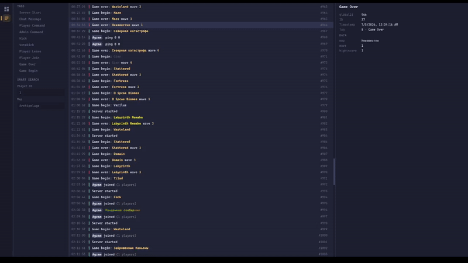
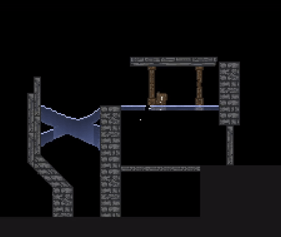
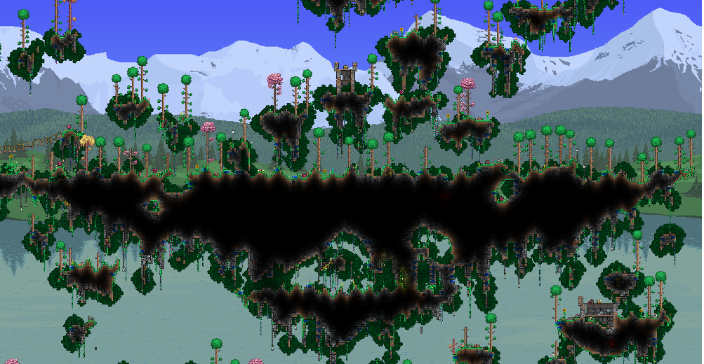

<!-- <h3>
<code>== [ Links ] ==</code>
</h3> -->

    
    
    

<!--# [Site](https://agzam4.github.io/Agzam4_/)
 &#8291; &#8291; &#8291;
 &#8291;

### In progress:
##### > https://github.com/Agzam4/writing-handwriting

##### > https://github.com/Agzam4/physics-ru

# Recommended projects:

***

***

***

***

### [More projects](https://github.com/Agzam4/Agzam4/wiki)
-->

---

### Mindustry Plugin + Web Admin Panel

Plugin for Mindustry with built-in web server, Telegram bot and permission system. Requires no more than 1 GB of RAM (linux + mindustry + plugin)

`Java` `React` `TypeScript` `SQLite` `REST API` `Telegram API` `Gradle` `Java APT`

> Annotation processor for generating TypeScript API and HTTP client from Java code

→ [github.com/Agzam4/Mindustry-plugin](https://github.com/Agzam4/Mindustry-plugin)

---

### 2D Pixel Physics Engine

Pixel-level material physics engine in Java

`Java`

> Infinite world based on dynamic grid (no hard map size limits)

→ [Video demo](https://youtu.be/FA3KZNn9lJY)

---

### Terraria Flying Islands Generator

Generator of floating island worlds for Terraria in JavaScript. Procedural generation of biomes, dungeons, pyramids, temples, trees and other structures

`JavaScript` `Procedural generation`

> No libraries

→ [github.com/Agzam4/TerrariaFlyingIslands](https://github.com/Agzam4/TerrariaFlyingIslands)

<!--
**Agzam4/Agzam4** is a ✨ _special_ ✨ repository because its `README.md` (this file) appears on your GitHub profile.

Here are some ideas to get you started:

- 🔭 I’m currently working on ...
- 🌱 I’m currently learning ...
- 👯 I’m looking to collaborate on ...
- 🤔 I’m looking for help with ...
- 💬 Ask me about ...
- 📫 How to reach me: ...
- 😄 Pronouns: ...
- ⚡ Fun fact: ...
-->
